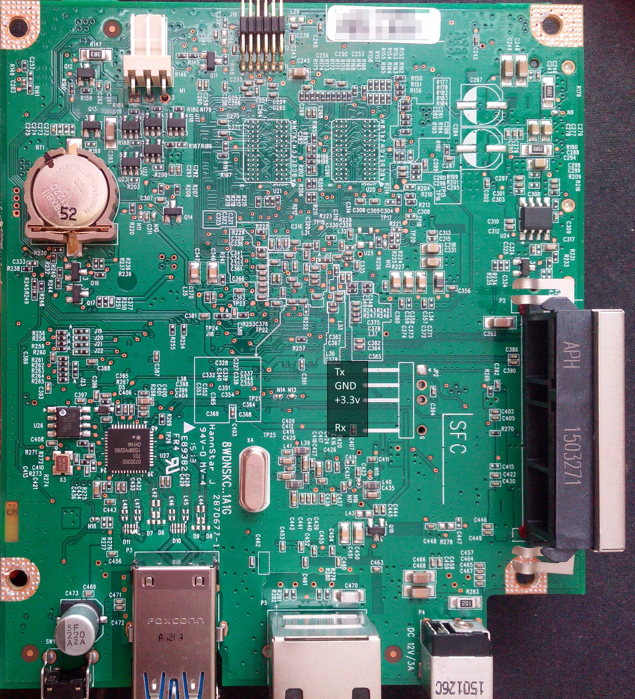

# KC-YCDI


This is the most tricky part of the guide, but you will understand the benefit and the skill you learnt at the end of the procedure.

## You need:
1. to disassemble your device
2. get access to the serial pins
3. solder 3 dupont cables
4. connect the cables to a computer. That is connect the serial from the device to a serial reader-transmitter. You can use a Rasperry PI if you own one as it comes with UARTs onboard. But you can also use a _USB to UART_ [^1] serial adapter which costs around 10$.

## Disassemble your device

There are no specific instruction, here. You just need some patience and unscrew it.
In My device there are just 4 main screws:
+ 2 visible on top near the disk enclosure
+ 2 on the base, accessible after you remove the plastic cover

Then you need to unscrew the metal chassis and to get access to the board.

## Get access to the serial pins

The board has a space dedicated to the serial connection. See this picture:


Should your board be different, WD adopt the convention of keeping the same drawing for the serial connection.

If you are unsecure about which is the right pin, continue to the next step with the soldering and then you can try to connect to the _USB to UART_ bridge.
Wrongly connecting GND, Tx, or Rx does not come with the risk to burn the serial circuits as these are TTL signals, so you can hardly do any damage here.      
Only solder and connect to +3.3V if your _USB to UART_ is not self powered (needs external power) as it increases the likelyhood to induct damage if you connect wrong pins.

## Solder 3 dupont cables

Yes, you need it :roll_eyes:

The simplest tip is to use 3 dupont cable (_male to male_ or _male to female_ ~10 cm).
You shall put the male end in the small hole and then put the tin and solder on it; wait few second the tin is meld and remove the solder blowing as much as you can : )
One tip: before putting the male pin, you can use pliers and give it a "L form". In this way, you can have the wire laying on to the board and just the pin endpoint entering the hole. You will gain stability during the soldering and furthermore you can leave the dupont cables soldered on when reassembling the device.

Only sold the GND, the TX and the RX pins. There is no need to solder also the +3.3 V (assuming your _USB to UART_ is powered).

## Connect the serial to your Computer

Now your setup is this:
+ WDMCloud with soldered dupont cable to access the serial of the device
+ A serial bridge like _USB to UART_ or a Raspberry PI

### 1. Figure out the serial bridge device
If you use Windows you can make use of putty but this is outside the scope of this article.

If you use the RaspberryPi you need to make sure it is configured correctly: As there are 2 UARTs onboard but not available at the same time and earlier RaspberryPi's had a timing issue that requires some settings you need to make sure to have your device enabled and the correct UART selected. The choice of the UART also changes the GPIOs you need to connect your GND, Rx, and Tx, to. Usually the device will be `/dev/ttyS0` or `/dev/ttyS1`.

If you use an _USB to UART_ bridge you can use `dmesg` to figure out its devicepath. Usually this will be `/dev/ttyUSB0`
```
kernel: [   17.620214] usbcore: registered new interface driver ch341
kernel: [   17.620303] usbserial: USB Serial support registered for ch341-uart
kernel: [   17.620465] ch341 1-1.4:1.0: ch341-uart converter detected
kernel: [   17.626101] ch341-uart ttyUSB0: break control not supported, using simulated break
kernel: [   17.626450] usb 1-1.4: ch341-uart converter now attached to *ttyUSB0*
```

Start a serial program like `minicom`.
If needed, configure the serial program to use ONLY SW flow control as you are not using CTS & RTS.
For example with `minicom -s`:
```
+-----------------------------------------------------------------------+
| A -    Serial Device      : /dev/ttyUSB0                              |
| B - Lockfile Location     : /var/lock                                 |
| C -   Callin Program      :                                           |
| D -  Callout Program      :                                           |
| E -    Bps/Par/Bits       : 115200 8N1                                |
| F - Hardware Flow Control : No                                        |
| G - Software Flow Control : Yes                                       |
| H -     RS485 Enable      : No                                        |
| I -   RS485 Rts On Send   : No                                        |
| J -  RS485 Rts After Send : No                                        |
| K -  RS485 Rx During Tx   : No                                        |
| L -  RS485 Terminate Bus  : No                                        |
| M - RS485 Delay Rts Before: 0                                         |
| N - RS485 Delay Rts After : 0                                         |
|                                                                       |
|    Change which setting?                                              |
+-----------------------------------------------------------------------+
```
Start `minicom` and wait the first signal is received

### 2. Connect the "USB to UART" to dupont cables

The connection is quite simple:
```
GND <-> GND
Tx  <-> Rx
Rx  <-> Tx
```

Should you have a different board and you need to discover the pins, use this considerations:
+ find GND at first; using a mutlimeter you should be able to recognise as it is short-cirtui with other pins or part, like chassis; moreover the GND has a stable reference w.r.t. the +3.3V pin (the fourth one you most likely have not soldered).
+ cycle the WD power off/on; during the boot sequence, the Tx should be `high` ~3V and Rx ~0V. 
+ connect the _WD Tx_ to the RX _USB to UART_; if the connection is fine, you should see a flashing led on the _USB to UART_ (if it has a led).
+ last connection is the Rx->Tx

### 3. Power ON the WDMC and check the connection

The WDMC is able to boot and load linux without any device connected.
If everything is fine, you should be able to login to your device via serial connection as you would be with an ssh connection.

[^1]: Just google _UST to UART_ on google or amazon
[Example 1](https://www.amazon.de/-/en/Mountaineer-CP2104-USB-Module-Converter-Compatible/dp/B01CYBHM26/ref=sr_1_3?crid=38G2KJ58ADXYF&keywords=usb%2Bauf%2Buart&qid=1648975046&sprefix=usb%2Bto%2Buart%2Caps%2C82&sr=8-3&th=1)
[Example 1](https://www.amazon.de/-/en/gp/product/B089YTXK8V/ref=ppx_yo_dt_b_search_asin_title?ie=UTF8&psc=1)
